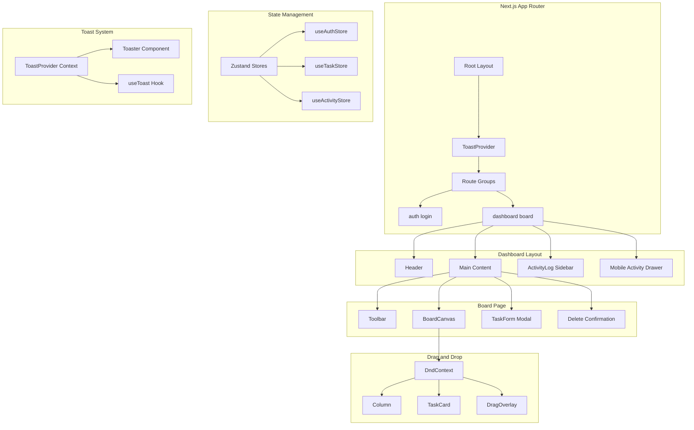
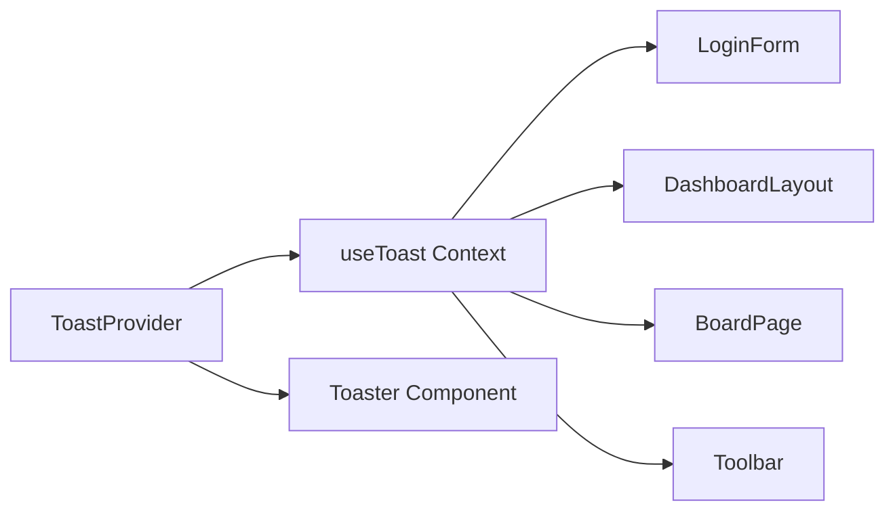
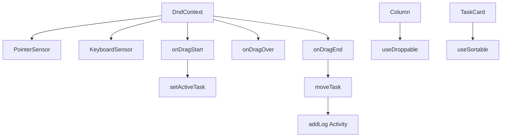
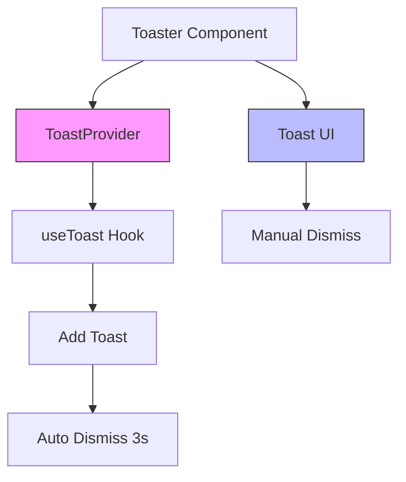

# Momentum

A minimal, mobile-responsive task management application built with Next.js App Router, React, TypeScript, and Tailwind CSS.

## Table of Contents

- [Architecture Overview](#architecture-overview)
- [Key Design Decisions](#key-design-decisions)
- [Tech Stack](#tech-stack)
- [Project Structure](#project-structure)
- [Setup Instructions](#setup-instructions)
- [Features](#features)
- [Component Architecture](#component-architecture)
- [State Management](#state-management)
- [Mobile Responsiveness](#mobile-responsiveness)
- [Toast Notification System](#toast-notification-system)

---

## Architecture Overview



---

## Key Design Decisions

### 1. Route Groups for Layout Separation

```
app/
├── (auth)/          # Auth group - no dashboard layout
│   └── login/
└── (dashboard)/     # Dashboard group - with sidebar
    ├── board/
    └── layout.tsx
```

**Why:** Route groups allow different layouts for different sections without affecting the URL structure.

### 2. Toast Notification Context

**Problem:** Each component using `useToast` had isolated state, so toasts called from child components didn't appear.

**Solution:** Created a `ToastProvider` at the root layout level using React Context, ensuring all components share the same toast state.



### 3. Mobile-First Responsive Design

**Board Canvas:**
- Desktop: 3-column grid (`grid-cols-3`)
- Mobile: Horizontal scroll with 85vw column width

**Activity Log:**
- Desktop: Fixed sidebar (`hidden lg:block`)
- Mobile: Slide-out drawer with backdrop

### 4. Drag & Drop Architecture

Using `@dnd-kit/core` and `@dnd-kit/sortable`:



### 5. Custom Event System for Task Actions

Task cards emit custom events for edit/delete to avoid prop drilling:

```typescript
// TaskCard dispatches
window.dispatchEvent(new CustomEvent("edit-task", { detail: task }));
window.dispatchEvent(new CustomEvent("delete-task", { detail: taskId }));

// BoardPage listens
window.addEventListener("edit-task", handleEdit);
window.addEventListener("delete-task", handleDelete);
```

---

## Tech Stack

| Category | Technology |
|----------|------------|
| Framework | Next.js 15 (App Router) |
| Language | TypeScript |
| Styling | Tailwind CSS 4 |
| State | Zustand + Persist |
| Drag & Drop | @dnd-kit/core, @dnd-kit/sortable |
| Icons | Lucide React |
| Date | date-fns |
| UI Components | shadcn/ui (Select) |

---

## Project Structure

```
momentum/
├── app/
│   ├── (auth)/
│   │   └── login/
│   │       └── page.tsx
│   ├── (dashboard)/
│   │   ├── board/
│   │   │   └── page.tsx
│   │   └── layout.tsx
│   ├── layout.tsx
│   └── globals.css
├── components/
│   └── ui/
│       ├── select.tsx
│       ├── toaster.tsx
│       └── toast-provider.tsx
├── features/
│   ├── auth/
│   │   └── components/
│   │       └── LoginForm.tsx
│   ├── board/
│   │   └── components/
│   │       ├── BoardCanvas.tsx
│   │       ├── Column.tsx
│   │       └── Toolbar.tsx
│   ├── tasks/
│   │   └── components/
│   │       ├── TaskCard.tsx
│   │       └── TaskForm.tsx
│   └── activity/
│       └── components/
│           └── ActivityLog.tsx
├── store/
│   ├── useAuthStore.tsx
│   ├── useTaskStore.tsx
│   └── useActivityStore.tsx
├── types/
│   └── index.ts
└── README.md
```

---

## Setup Instructions

### Prerequisites

- Node.js 18+
- npm or pnpm

### Installation

```bash
# Clone the repository
git clone <repository-url>
cd momentum

# Install dependencies
npm install

# Run development server
npm run dev

# Open http://localhost:3000
```

### Login Credentials

```
Email: intern@demo.com
Password: intern123
```

---

## Features

### Authentication
- Simple email/password login
- Zustand auth store with persistence
- Protected dashboard routes
- Toast notifications for login/logout

### Task Management
- Create, read, update, delete tasks
- Drag & drop between columns (Todo, Doing, Done)
- Priority levels (Low, Medium, High)
- Due dates and tags
- Search and filter functionality
- Sort by date

### Activity Tracking
- Real-time activity log
- Tracks create, update, delete, move actions
- Mobile-friendly slide-out drawer

### UI/UX
- Toast notifications for all actions
- Green highlight on drag hover
- Mobile-responsive design
- Smooth animations

---

## Component Architecture

### DashboardLayout

```typescript
interface DashboardLayoutProps {
    children: React.ReactNode;
}

// Features:
// - Authentication check
// - Hydration handling
// - Toast provider integration
// - Mobile activity drawer
// - Logout functionality
```

### BoardCanvas

```typescript
interface BoardCanvasProps {
    // Uses Zustand stores internally
}

// Features:
// - DndContext setup
// - Filter/sort logic
// - Drag & drop handlers
// - Task action event dispatchers
```

### Column

```typescript
interface ColumnProps {
    column: ColumnType;
    tasks: Task[];
    onEditTask: (task: Task) => void;
    onDeleteTask: (taskId: string) => void;
}

// Features:
// - Droppable target
// - Green highlight on drag over
// - Sortable context
```

### TaskCard

```typescript
interface TaskCardProps {
    task: Task;
    onEdit: (task: Task) => void;
    onDelete: (taskId: string) => void;
}

// Features:
// - Sortable drag handle
// - Priority badge
// - Tags display
// - Due date formatting
// - Edit/Delete actions
```

---

## State Management

### useAuthStore

```typescript
interface AuthState {
    user: User | null;
    isAuthenticated: boolean;
    login: (email: string) => void;
    logout: () => void;
}
```

### useTaskStore

```typescript
interface TaskState {
    tasks: Task[];
    columns: Column[];
    searchQuery: string;
    filterPriority: Priority | 'All';
    sortBy: 'date' | 'none';
    addTask: (task: TaskInput) => void;
    updateTask: (id: string, data: Partial<Task>) => void;
    deleteTask: (id: string) => void;
    moveTask: (taskId: string, newStatus: TaskStatus) => void;
    resetBoard: () => void;
}
```

### useActivityStore

```typescript
interface ActivityState {
    logs: ActivityLog[];
    addLog: (action, taskId, taskTitle, details) => void;
}
```

---

## Mobile Responsiveness

### Breakpoints

| Breakpoint | Width | Layout Changes |
|------------|-------|----------------|
| Mobile | < 640px | Single column, horizontal scroll |
| Tablet | 640-1024px | Adjusted spacing, visible activity button |
| Desktop | > 1024px | 3-column grid, sidebar visible |

### Mobile-Specific Features

1. **Horizontal Board Scroll**
   - Columns are 85vw wide
   - Swipe to navigate between columns

2. **Activity Drawer**
   - Slide-out from right
   - Backdrop overlay
   - Close button in header

3. **Touch-Friendly**
   - Larger tap targets
   - Always-visible edit/delete buttons
   - Touch-manipulation CSS

4. **Responsive Text**
   - Smaller font sizes on mobile
   - Abbreviated button labels

---

## Toast Notification System

### Architecture



### Usage

```typescript
import { useToast } from "@/components/ui/toast-provider";

function MyComponent() {
    const { toast } = useToast();
    
    const handleAction = () => {
        toast({
            title: "Success!",
            description: "Action completed",
            variant: "success", // "default" | "success" | "error" | "warning"
        });
    };
}
```

### Variants

| Variant | Color | Use Case |
|---------|-------|----------|
| default | White/Neutral | General notifications |
| success | Green | Successful actions |
| error | Red | Errors, failures |
| warning | Amber | Warnings, destructive actions |

---

## Drag & Drop Implementation

### Sensors

```typescript
const sensors = useSensors(
    useSensor(PointerSensor, {
        activationConstraint: {
            distance: 5, // Prevent accidental drags
        }
    }),
    useSensor(KeyboardSensor, {
        coordinateGetter: sortableKeyboardCoordinates,
    })
);
```

### Visual Feedback

- **Drag Start:** Task becomes semi-transparent
- **Drag Over Column:** Column background turns green
- **Drop Animation:** Smooth transition back to position

---

## Future Enhancements

- [ ] Real-time collaboration (WebSockets)
- [ ] Backend API integration
- [ ] User registration
- [ ] Task assignments
- [ ] Due date notifications
- [ ] Dark mode
- [ ] Keyboard shortcuts
- [ ] Undo/redo functionality

---

## License

MIT
